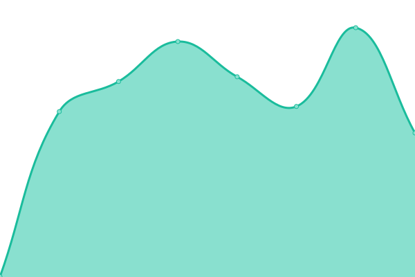

# [📈 Live Status](https://status.pokefarm.com): <!--live status--> **🟩 All systems operational**

This repository contains the open-source uptime monitor and status page for [pokefarm.com](https://status.pokefarm.com), powered by [Upptime](https://github.com/upptime/upptime).

With [Upptime](https://upptime.js.org), you can get your own unlimited and free uptime monitor and status page, powered entirely by a GitHub repository. We use [Issues](https://github.com/pokefarm-com/status/issues) as incident reports, [Actions](https://github.com/pokefarm-com/status/actions) as uptime monitors, and [Pages](https://status.pokefarm.com) for the status page.

<!--start: status pages-->
<!-- This summary is generated by Upptime (https://github.com/upptime/upptime) -->
<!-- Do not edit this manually, your changes will be overwritten -->
<!-- prettier-ignore -->
| URL | Status | History | Response Time | Uptime |
| --- | ------ | ------- | ------------- | ------ |
|  [PFQ Main Site](https://pokefarm.com/health) | 🟩 Up | [pfq-main-site.yml](https://github.com/pokefarm-com/status/commits/HEAD/history/pfq-main-site.yml) | 

 356ms
     
 | 

<a href="https://status.pokefarm.com/history/pfq-main-site">99.44%</a>
    

|  [PFQ Wiki](https://pokefarm.wiki) | 🟩 Up | [pfq-wiki.yml](https://github.com/pokefarm-com/status/commits/HEAD/history/pfq-wiki.yml) | 

 1133ms
     
 | 

<a href="https://status.pokefarm.com/history/pfq-wiki">100.00%</a>
    

|  [PFQ API](https://api.pokefarm.com/v1/health) | 🟩 Up | [pfq-api.yml](https://github.com/pokefarm-com/status/commits/HEAD/history/pfq-api.yml) | 

 913ms
     
 | 

<a href="https://status.pokefarm.com/history/pfq-api">98.81%</a>
    

|  [PFQ Discord Bot](https://pfq.moons.bio/health) | 🟩 Up | [pfq-discord-bot.yml](https://github.com/pokefarm-com/status/commits/HEAD/history/pfq-discord-bot.yml) | 

 413ms
     
 | 

<a href="https://status.pokefarm.com/history/pfq-discord-bot">100.00%</a>
    

<!--end: status pages-->

[**Visit our status website →**](https://status.pokefarm.com)

## 📄 License

- Powered by: [Upptime](https://github.com/upptime/upptime)
- Code: [MIT](./LICENSE) © [Anand Chowdhary](https://anandchowdhary.com), supported by [Pabio](https://pabio.com)
- Data in the `./history` directory: [Open Database License](https://opendatacommons.org/licenses/odbl/1-0/)
